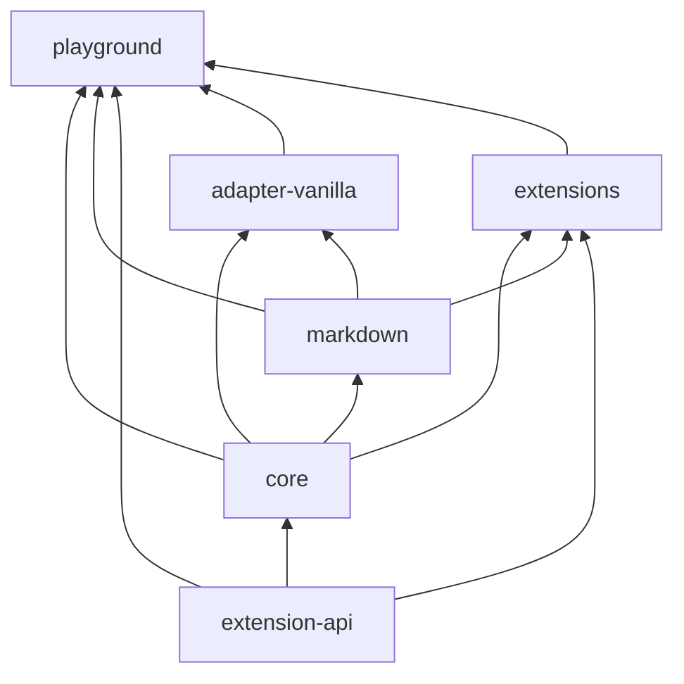

# UC Markdown Web

프레임워크 중립 WYSIWYG Markdown 에디터를 위한 pnpm workspace 제공.

## 시작

```bash
pnpm install --frozen-lockfile
pnpm build
pnpm typecheck
pnpm test
```

## 패키지

| 패키지 | 책임 | 공개 진입점 | 허용 의존성 |
|---|---|---|---|
| `@uc-markdown-web/extension-api` | 확장 개발용 공용 타입과 계약 | `.` | 외부 프레임워크 의존성 없음 |
| `@uc-markdown-web/core` | 편집기 코어와 공용 설정 | `.` | `extension-api` |
| `@uc-markdown-web/markdown` | Markdown 입출력 계층 | `.` | `core` |
| `@uc-markdown-web/adapter-vanilla` | DOM 연결 lifecycle | `.` | `core`, `markdown` |
| `@uc-markdown-web/extensions` | 도메인별 편집기 확장 | `.` | `core`, `markdown`, `extension-api` |
| `@uc-markdown-web/playground` | 통합 확인용 private 소비 앱 | `src/main.ts` | 라이브러리 5개 |

라이브러리 5개는 `package.json`의 `exports`와 `types`로 `dist/index.js`, `dist/index.d.ts`를 공개함. 모든 패키지는 현재 `private: true` 상태이며 `0.x` 실험 API로서 하위 호환성을 보장하지 않음.

실제 npm 게시은 다음 외부 결정값이 모두 확정될 때까지 차단함: npm 조직·공개 패키지명·게시 권한·라이선스. 이 저장소는 원격 게시 없이 현재 로컬 식별값으로 tarball 소비 검증만 수행함.



## 검증 범위

| 명령 | 확인 항목 |
|---|---|
| `pnpm build` | 라이브러리 ES 번들과 TypeScript 선언 파일, playground 번들 |
| `pnpm typecheck` | 패키지별 TypeScript 타입 검사 |
| `pnpm test` | 공개 진입점 소비 smoke test와 단위 테스트 |
| `node scripts/release/verify-pack.mjs` | 다섯 로컬 tarball 구성·메타데이터·격리 소비자 JavaScript/TypeScript import |

지원 브라우저 정책과 향후 Playwright 검증 범위는 [지원 브라우저 정책](<docs/[SPEC]_BROWSER_SUPPORT.md>)에서 관리함.
